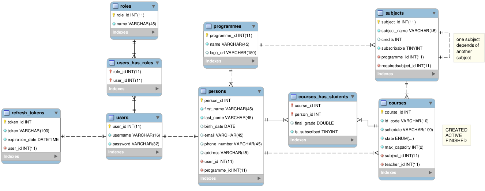

# eduap backend

Aplicación backend desarrollada con Spring boot, exponiendo servicios para la creación, consulta parametrizada, modificación y autenticación de usuarios por medio de JWT (Json Web Tokens). Adicionalmente, las personas están asociadas a un programa y se exploran otras funcionalidades del framework Spring boot como:
- Carga de archivos
- Uso y personalización del módulo de seguridad de Springboot
- Creación de directiva personalizada para validación de atributos de una entidad
- Manejo de excepciones
- Implementación de OpenAPI para la generación de documentación propia de los servicios expuestos
- Sistema basado en roles para limitar el acceso a los servicios a los distintos tipos de usuarios
- Protección de rutas para usuarios no autenticados
- Generación y ejecución de pruebas unitarias y de integración (JUnit y Mockito)

Se sigue el modelo entidad relación descrito a continuación:


### Herramientas empleadas

| Herramienta | Versión |
| ------------- | ------------- |
| Java (Openjdk)  | 17.0.7  |
| Spring boot  | 3.0.6  |
| Mariadb  | 10.4.28  |
| Linux Mint  | 21.1 Vera |

Commandos

- Empaquetar aplicación
```
- ./mvnw package
```
- Ejecutar servidor
```
- java -jar ./target/eduapp-0.0.1-SNAPSHOT.jar
```

Al ejecutar el servidor, se puede consultar la documentación de los servicios expuestos por medio de la herramienta Swagger UI al acceder a la url: 

http://localhost:8080/swagger-ui/index.html

Este proyecto se desarrolla en conjunto con una aplicación cliente en Angular, cuyo repositorio se encuentra alojado en la url: https://github.com/luE11/eduappfrontend
